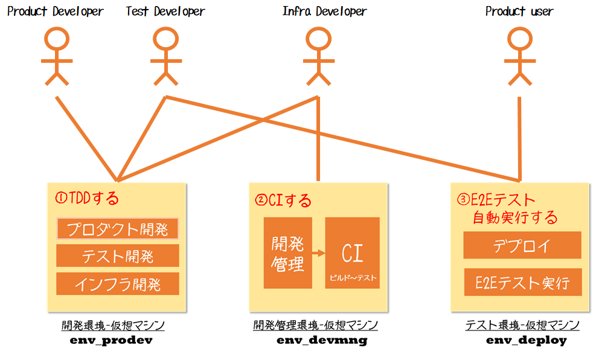
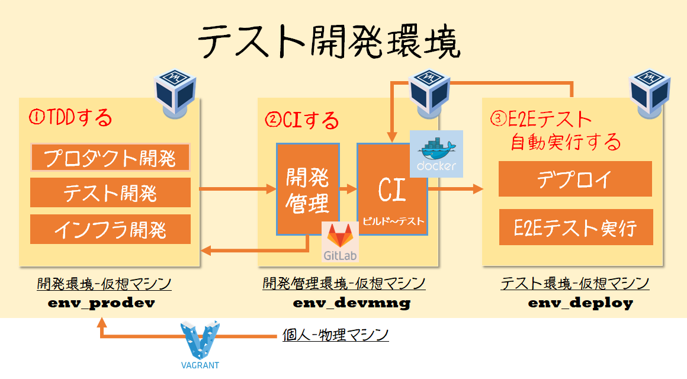

# Settler
Development environment construction tool

## Table of contents

* [Tools](#Tools)
* [OS](#OS)
* [Environment Type](#Environment_Type)
* [Usage](#Usage)
* [Installed software](#Installed_software)

## Tools

* cygwin(latest)
* git(latest)
* vagrant(2.0.1)
* virtualbox(5.2.4.r119785)
* vagrant plugin
  * vagrant-vbguest
  * vagrant-vbox-snapshot
  
    ```
    $ vagrant plugin install vagrant-vbguest
    ```

## OS

* CentoOS 7.4

## Environment_Type

| Type       | default private ip    | user    | Description                              |
| :--------- | :-------------------- | :------ | :--------------------------------------- |
| env_prodev | 192.168.10.10         | vagrant | Support development product              |
| env_devmng | 192.168.10.100        | vagrant | Support using development management tool|
| env_deploy | 192.168.10.200        | vagrant | Support deploy and testing               |



## Environment_context



## Usage

1. start

```
$ git clone https://github.com/dandan611/Settler.git
$ cd <Vagrantfile directory:env_prodev>
$ vagrant up
$ ssh vagrant@192.168.10.10
```

2. stop

```
vagrant halt
```

3. destroy

```
$ vagrant destroy -f
```

>>>
**NOTE**
When an error occurs Execute the following command to check the cause.
```
EXCON_DEBUG=1 vagrant up --debug
```
>>>

## Installed_software

| Installed Software | Version | Purpose | env_prodev | env_devmng | env_deploy |
| :----------------- | :-----: | :------ | :-----: | :-----: | :-----: |
|GNOME Desktop       |latest   | GUI     | ○       | ○       | ○       |
|Ansible             |latest   | provision | ○       | ○       | ○       |
|Git                 |latest   | install | ○       | ○       | ○       |
|Docker              |latest   | use image | -       | ○       | -       |
|Python              |3.6      | dev and use | ○       | ○       | ○       |
|GitLab on docker    |11.1.4   | git repo and ci| -       | ○       | -       |
|Google Chrome       |latest   | use product| ○       | ○       | ○       |
|||||||
